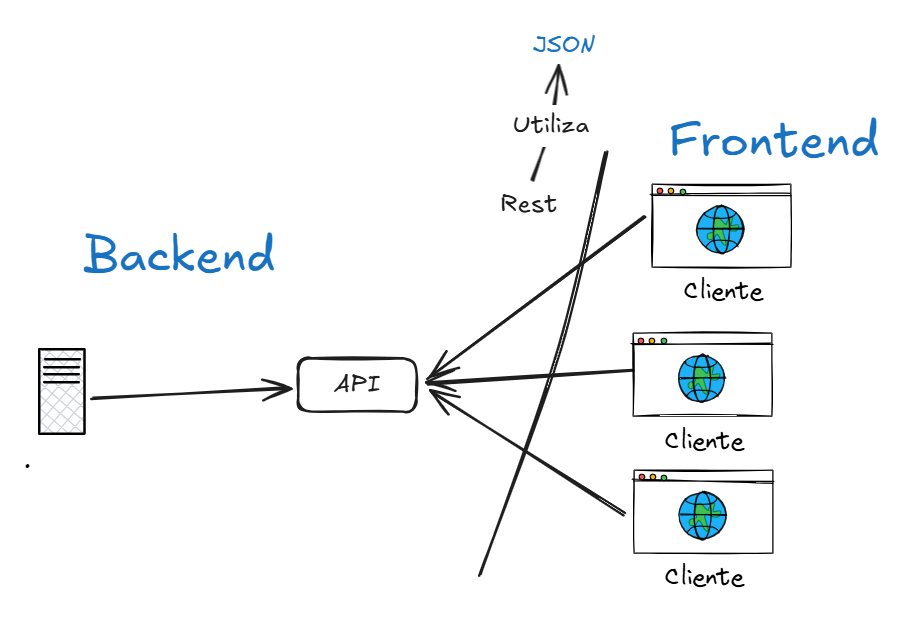

# Lunes 20 de enero, 2026.

# API.

- La API es un puente.
- Ejemplo: API REST.
- Se comunican con JSON en el modelo API REST.

# Aplicaciones móviles.

## Tipos de aplicaciones móviles.

- Nativos.
  - Solo para un sistema operativo.
- Híbridos.
  - Para múltiples plataformas.
- Progresivas (PWA).
  - No están disponibles en tiendas y funcionan offline.
  - Se utilizan para actividades muy específicas, como en negocios.
  - Es realmente un enfoque, ya que pueden ser nativas o híbridas.

# Arquitectura cliente - servidor.

- Frontend (app) y backend (API / servidor).
- El frontend se actualiza constantemente, mientras que el backend no suele cambiar tanto sus reglas de negocio.
- Analogía: el cerebro es el backend que va cambiando los pensamientos y el cuerpo va constantemente envejeciendo.
- Ejemplo:
  - 
